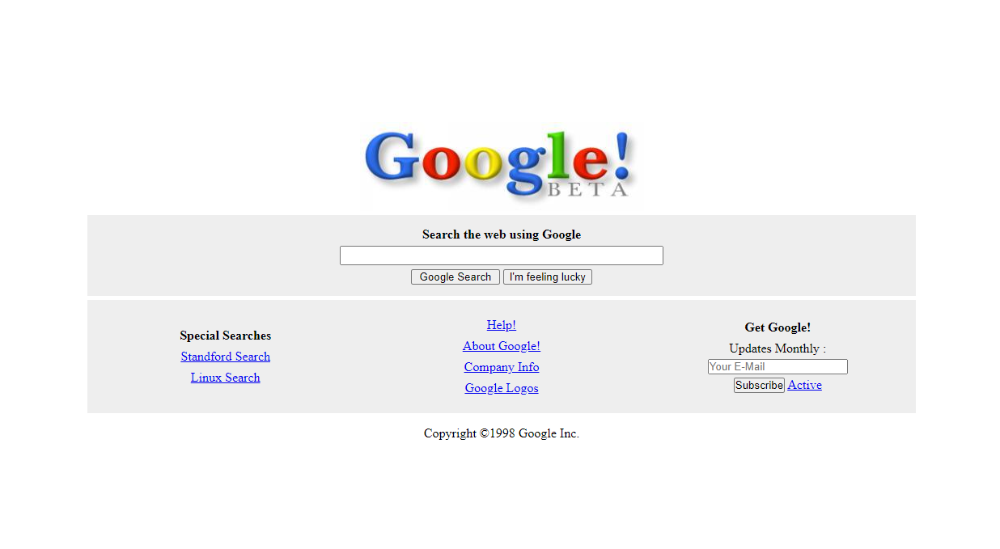

# Google 1998 Clone

Bu repo [Patika.Dev](https://www.patika.dev) Front-End Eğitiminde ödev olarak yapmış olduğum Google 1998 Clone uygulaması.



## Installation
Öncelikle projeyi clonelayın.[Google 1998 Clone](https://github.com/cmucahit/Google98Clone.git)


```bash
git clone https://github.com/cmucahit/Google98Clone.git
```

## Usage

Projeyi cloneladıktan sonra Visual Studio Code programında açınız.

Linux için:


## Contributing

Pull requestler kabul edilir.

## License

[MIT](https://choosealicense.com/licenses/mit/)
